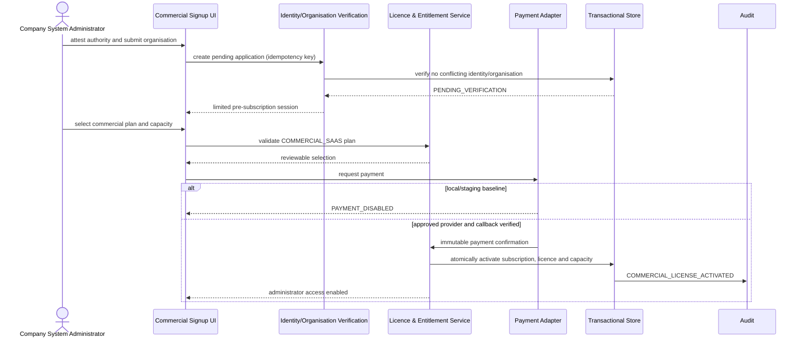
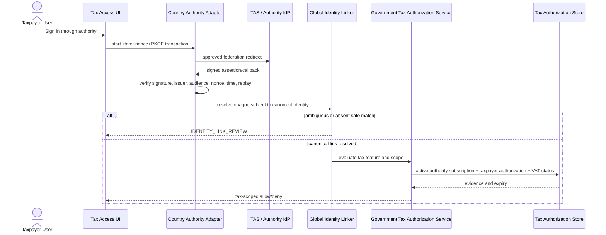
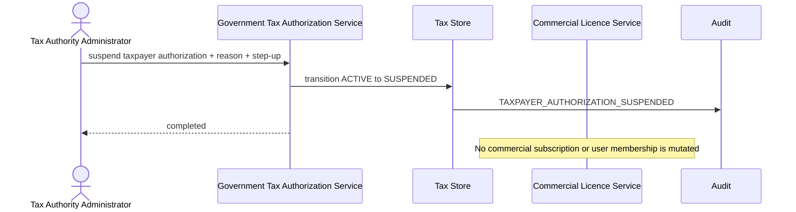

# Dual-subscription sequence diagrams

## Commercial application and gated activation



## Taxpayer federation and independent tax decision



## Concurrent finite-seat enforcement

```mermaid
sequenceDiagram
  actor A as Administrator A
  actor B as Administrator B
  participant API as User Provisioning API
  participant L as Licence & Entitlement Service
  participant DB as Database Transaction
  par request seat 100
    A->>API: invite employee (idempotency A)
  and competing request
    B->>API: invite employee (idempotency B)
  end
  API->>L: CanCreateUser?
  L->>DB: begin serialized seat transaction
  DB->>DB: count ACTIVE + reserved INVITED seats
  alt one seat remains
    DB->>DB: create one invitation and consume seat
    DB-->>L: success
    DB-->>L: USER_LICENSE_LIMIT_REACHED for competing transaction
  else unlimited capacity
    DB->>DB: create both invitations; no numeric ceiling
  end
  L-->>API: stable decision codes
```

## Tax suspension leaves commercial access unchanged



## Downgrade below active use

```mermaid
sequenceDiagram
  actor A as Company System Administrator
  participant L as Licence & Entitlement Service
  participant DB as Commercial Store
  participant AU as Audit
  A->>L: request capacity downgrade 100 to 50
  L->>DB: compare active/reserved seats (87) with target (50)
  DB->>DB: activate target entitlement and create CAPACITY_EXCEPTION
  DB->>AU: LICENSE_CAPACITY_EXCEPTION_OPENED
  L-->>A: mutation/new-user provisioning restricted; no users deleted
  A->>DB: deactivate memberships non-destructively
  DB->>DB: release seats while preserving history
  DB-->>L: active use <= 50
  L->>DB: resolve capacity exception
```
