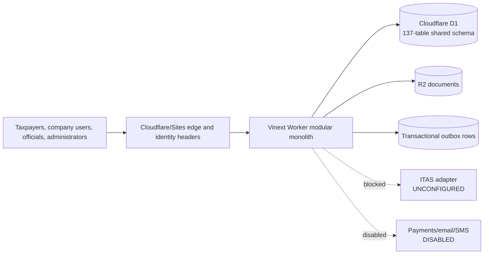
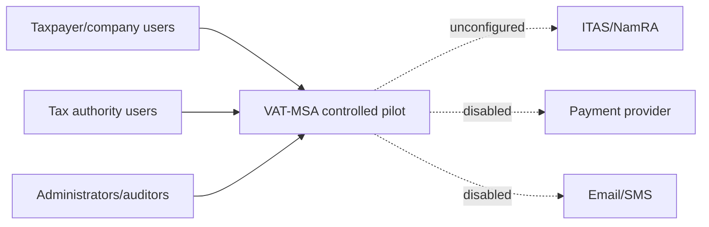
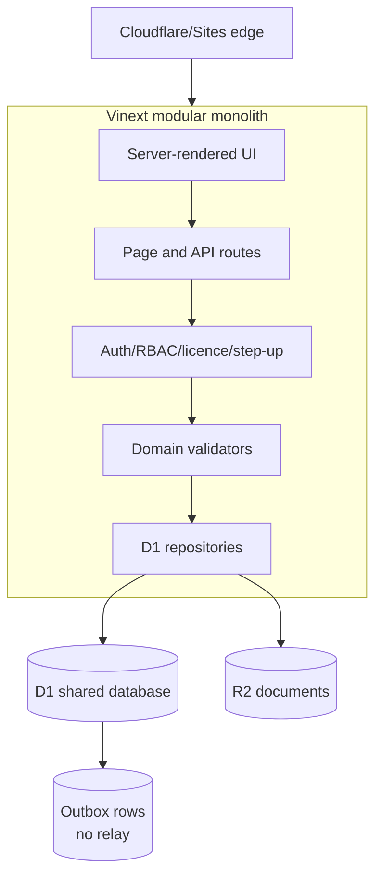
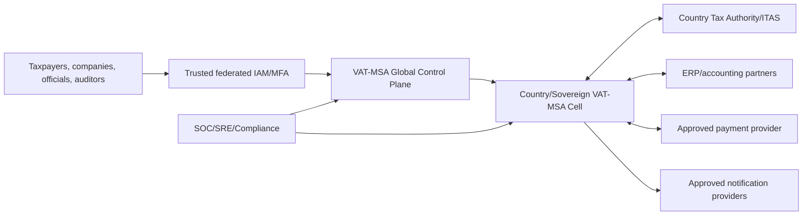
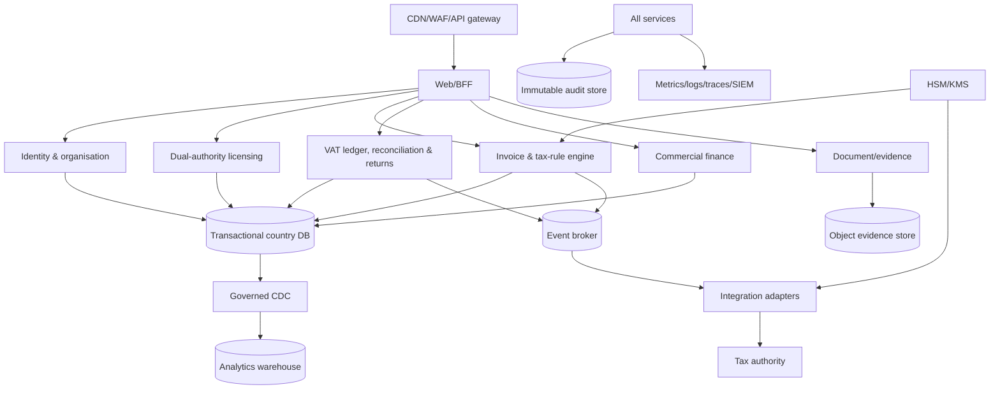
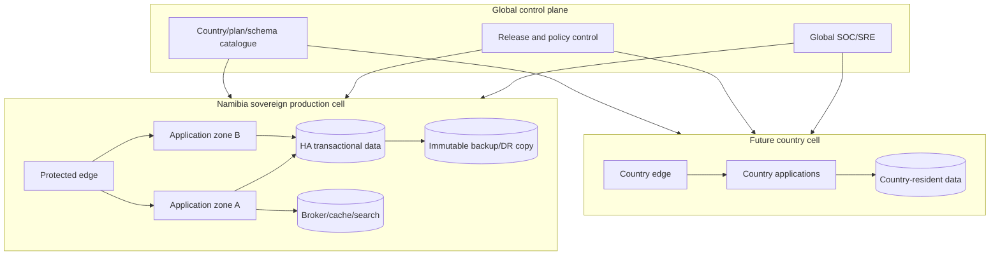

# VAT-MSA Current-State Assessment & Global Enterprise Transformation Report

> **Superseded current-state facts:** This report assesses commit `496daf0` before the accepted Phase 0 remediation. Its forensic inventory remains useful, but current runtime, dependency, OpenAPI, statutory-binding and identity-step-up findings must be read with [CURRENT STATE ASSESSMENT.md](CURRENT%20STATE%20ASSESSMENT.md), which assesses the post-Phase 0 baseline and the controlled Issue 1 increment.

**Assessment date:** 23 August 2026

**Assessed repository:** `C:\Users\Jean-Pierre\Desktop\2026 FOLDERS\SAFINA BUSINESS ADVISORY\SAFINA\VAT Management System`

**Baseline:** `main` at `496daf0e5c67949347534ef922c10a495ceb6488`

**Assessment mode:** Evidence-based, non-destructive, local/staging only

**Decision boundary:** Assessment only. No application, schema, authentication, licensing, infrastructure, or production configuration remediation was performed.

## Assessment basis and confidence

This report is based on source-code inspection, schema and migration inspection, route and OpenAPI comparison, architecture-document review, infrastructure-manifest review, browser rendering against the canonical local repository, and non-destructive release diagnostics. A file, route, table, screen, diagram, or test name was not treated as proof of an operational capability.

Evidence vocabulary used throughout:

| Status | Evidential meaning in this report |
| --- | --- |
| Designed | Architecture or design material exists. |
| Specified | A requirement or contract exists. |
| UI Only | A surface exists without a verified operational chain. |
| Backend Only | Logic exists without a complete usable experience. |
| Database Only | Persistence structures exist without operational application behaviour. |
| Partially Implemented | Some elements work, but the required end-to-end chain is incomplete. |
| Implemented | Executable implementation exists. |
| Integrated | Required internal or external connection is implemented. |
| Functional | The assessed end-to-end path was successfully exercised. |
| Tested | Relevant automated or observed test evidence exists. |
| Production-Ready | Security, resilience, deployment, statutory, and operational gates are evidenced. |
| Enterprise-Ready | Enterprise governance, scale, security, data, and operations are evidenced. |
| Global-Ready | Multi-country operation and jurisdictional controls are evidenced. |

Where a conclusion cannot be supported, this report states **NOT VERIFIED — INSUFFICIENT EVIDENCE**.

## 1. Executive Summary

VAT-MSA is a substantial controlled-pilot codebase with multiple implemented vertical slices, not a production, enterprise, or global platform. It has a coherent dual-authority model, organisation and user controls, tax and commercial capability foundations, central licence enforcement, maker-checker controls, receipt-governed expenses, transactional outbox records, and a broad user interface. The codebase is materially beyond a visual prototype.

The assessed canonical local system is nevertheless not currently deployable. Browser inspection on 23 August 2026 found that `/` and `/signup/company` return a generic server error because the runtime database initializer fails with `D1_ERROR: FOREIGN KEY constraint failed` while executing the licence-enforcement seed batch at `db/runtime.ts:2140`. Public `/signup`, `/signup/tax-services`, and `/signup/employee` render successfully. This establishes a release-blocking difference between build-time success and runtime viability.

The most serious business defect is statutory integrity. Invoice validation accepts a caller-supplied `STANDARD` tax rate anywhere from 0% to 100% if the arithmetic is internally consistent (`lib/domain/invoice.ts:138`, `lib/domain/invoice.ts:159-180`). Invoice certification does not resolve an approved, jurisdiction-specific, effective-dated rule set, yet the response declares the fixed version `NA-VAT-PILOT-2026.1` (`app/api/v1/invoices/route.ts:63`). A tax invoice could therefore be internally consistent but statutorily wrong.

The most serious security and operational findings are:

- production identity and step-up assurance depend on trusted upstream headers without repository evidence of cryptographic verification or enforced direct-origin isolation (`app/chatgpt-auth.ts:11-25`, `lib/security/step-up.ts:7-15`);
- the dependency audit fails with 23 advisories: 1 critical, 10 high, 9 moderate, and 3 low; reachability varies, but production exploitability has not been analysed;
- the configured `security:ci` gate omits `security:audit` (`package.json:18-20`);
- certificate signing uses `DEV-SHA256` (`lib/data/repository.ts:346`), not a controlled HSM/KMS-backed signing service;
- ITAS is explicitly an unconfigured adapter (`lib/integrations/itas.ts:54-76`);
- outbox records exist, but no deployed publisher, broker, consumer, replay service, or delivery evidence exists;
- infrastructure artefacts are reference baselines with a placeholder image and no evidenced production environment (`infrastructure/kubernetes/base/deployment.yaml:49`);
- no CI workflow, E2E suite, DAST, continuous SAST/SCA gate, restore exercise, failover result, or production load-test result was found.

**Executive determination:** VAT-MSA is a **Functional System at controlled-pilot maturity**, with meaningful implemented foundations, but the assessed local deployment is currently broken and the platform is **not production-ready, enterprise-ready, or global-ready**.

## 2. System Inventory

| Inventory item | Observed quantity | Interpretation |
| --- | ---: | --- |
| Assessed source/config/document files, excluding dependency/build output | 438 | Broad pilot and architecture package |
| Application files | 112 | Vinext/React application and routes |
| API route files | 54 | 52 `/api/v1` paths plus two health paths |
| Page routes | 41 | Workspaces, portals, business functions, and signup |
| Drizzle migrations | 15 | Migrations `0000` through `0014` |
| Drizzle tables | 137 | Wide control-plane and domain data model |
| Unique indexes in schema | 107 | Significant declared integrity intent |
| Non-unique indexes in schema | 76 | Broad access-path coverage; query suitability not benchmarked |
| Declared schema checks | 19 | Select high-risk invariants are database-enforced |
| Migration triggers | 38 | Strongest around decisions, receipts, licensing, and signup |
| Migration foreign keys | 276 | Highly relational data model |
| Migration views | 2 | Limited derived read model |
| Automated test files | 18 | Unit/domain, migration, policy, and source-enforcement tests |
| Automated tests executed | 93/93 passed | Good pilot regression signal, not E2E proof |
| OpenAPI paths | 39 | Contract is incomplete relative to 52 runtime v1 paths |
| Architecture/security/infrastructure documents and diagrams | More than 200 | Strong design intent; implementation proof varies |

Primary runtime stack: TypeScript, React 19, Vinext beta, Vite 8, Cloudflare Worker, D1, R2, Drizzle, and Vitest. `.openai/hosting.json` binds D1 as `DB` and R2 as `DOCUMENTS`, showing a Sites/Cloudflare deployment target. There is no evidenced production account, project, region, registry, domain, WAF policy, KMS/HSM, or managed observability deployment.

## 3. Current Architecture

The current implementation is a server-rendered modular monolith deployed conceptually as one Cloudflare Worker application. Page and API handlers call domain validators and D1 repositories directly. D1 holds transactional, identity, licensing, audit, outbox, operational, and reporting state. R2 is declared for documents. External identity is accepted through hosting-injected headers. ITAS, payments, messaging, and event delivery remain disabled or unconfigured.

Architectural strengths include explicit domain validators, transactional D1 batches for important commands, idempotency on selected ingestion paths, licence and permission guards, dual authority modelling, and extensive constraints for recent high-risk features.

Architectural weaknesses include direct coupling between handlers and a single broad database, runtime schema bootstrapping, no operational event plane, no externally verified identity control plane, no authoritative statutory rules service in invoice certification, and no independently evidenced production cell.

## 4. Current Functional Capability Matrix

| Capability | Evidence classification | What actually works | Missing end-to-end element |
| --- | --- | --- | --- |
| Identity and sign-in | Partially Implemented, Tested foundation | Header identity maps to provisioned links; non-production pilot identity exists | Production IdP contract, MFA/recovery evidence, signed assertion verification, origin isolation |
| One taxpayer → one organisation → many users | Implemented, Tested foundation | Canonical taxpayer/organisation/membership structures and uniqueness controls | Production identity proofing and national registry reconciliation |
| Dynamic buyer/seller roles | Implemented | Parties and invoice ledger create seller output/buyer input positions | External VAT/TIN/company validation and production counterparty trust |
| Government tax subscription | Database + Backend, Tested foundation | Separate authority domain, tax plans, authorizations, no-self-approval | Operational authority provisioning/federation and approved production plan governance |
| Commercial subscription | Database + Backend, Tested foundation | Separate commercial plan/feature/capacity model | Payment, activation, renewal, upgrade/downgrade operations, provider governance |
| Central licence enforcement | Implemented, source-policy Tested | Protected pages, portals, API, search, and commands route through a central guard; expiry continuity is modelled | Live bypass/penetration/race evidence and current runtime viability |
| Self-service company signup | Partially Implemented | Immutable pending intake and validation exist | Assessed page currently fails; no verification, payment, provisioning, activation, or account creation |
| Tax-service signup | UI Only for production access | Clear authority-only path renders | Live ITAS/authority adapter and operational authorization |
| Employee onboarding | UI + Backend invitation foundation | Admin invitation record reserves capacity | No delivered email/SMS and no verified invitation acceptance/token flow |
| Invoice submission | Backend Implemented, unit Tested | Bounded payload, idempotency, D1 batch, invoice, ledgers, audit, outbox | Statutory rate/rule binding, production signing, external identity validation, runtime E2E |
| VAT ledgers | Implemented foundation | Seller output and buyer input entries created with invoice | Production-scale reconciliation and authoritative taxpayer identity |
| Reconciliation | Partially Implemented | Exceptions, views, and workflows exist | Full resolution lifecycle, external matching feeds, measured operations |
| VAT returns | Partially Implemented, Tested foundation | Effective rule set is resolved for return drafting; maker-checker controls exist | Approved statutory formulas/mappings and live authority submission |
| Refunds, disputes, audit cases | Partially Implemented | Commands, state, and outbox records exist | Authority operating procedures, integration, complete case lifecycle and evidence |
| Accounting journals | Partially Implemented | List/post path and balanced-domain validation foundation | Finance-approved posting policy, periods, close, reversal, sub-ledgers, statements |
| Expenses | Implemented, migration Tested | Receipt link, category rule, clean scan, maker-checker, immutable decision constraints | Accounting posting/reversal and production malware scanning |
| Inventory | Partially Implemented | Movement recording and views | Costing, reservations, stocktake, valuation, integration to accounting |
| Quotations | Implemented foundation | CRUD-like lifecycle, accept/reject/expire/convert | Full commercial fulfilment, invoice policy binding, E2E UI proof |
| Projects/workflows | Partially Implemented | Projects, versioned workflows, decisions, SoD | Comprehensive process catalogue and operational E2E proof |
| Documents | Partially Implemented | Quarantine/status data and R2 binding | Real malware/CDR service, retention/legal hold, production R2 controls |
| Audit trail | Partially Implemented | Hash-linked audit rows and broad action events | Concurrency-safe serialization, WORM retention, independent verification/export |
| Reports/search | Partially Implemented | Repository-backed reports and scoped search exist | Warehouse/read models, high-volume proof, complete report catalogue |
| Offline | Partially Implemented | Batch/sequence/hash validation foundation | Device trust, field rollout, sync conflict operations, security testing |
| ITAS | Placeholder | Explicit safe failure | Real contract, SSO, API, synchronization, reconciliation, security acceptance |
| Payments | Database Only / Disabled | Instruction/status records exist | Provider, sandbox flow, settlement reconciliation, production authorization |
| Events/webhooks | Database + Backend Only | Transactional outbox and webhook models | Publisher, broker, consumers, replay, DLQ, operational delivery |
| Notifications | Database/metadata Only | Disabled delivery markers | Provider integrations, consent, templates, bounce/failure handling |
| AI | Not Implemented | No operational model or AI service found | Product case, governance, data controls, model platform, human oversight |

No major capability qualifies as Production-Ready, Enterprise-Ready, or Global-Ready on current evidence.

## 5. Implementation Maturity Matrix

| Layer | Designed/Specified | Implemented | Integrated | Functional/Tested | Production evidence |
| --- | --- | --- | --- | --- | --- |
| User experience | Broad | Broad public/protected page set | Internal only | Public onboarding pages observed; protected runtime failed | None |
| Application/domain | Broad | Strong pilot vertical slices | D1/R2 target | 93 unit/policy/migration tests pass | None |
| Data | Broad 137-table model | D1 schema/migrations/triggers | Application-coupled | Migration tests; current seed bootstrap fails | No scale/restore/residency proof |
| APIs | Broad | 52 v1 runtime paths | Internal only | Build and source tests pass | Contract incomplete; no E2E/DAST |
| External integration | Broad adapters/models | Safe placeholders | Not integrated | Failure states represented | None |
| Security | Broad control design | RBAC/licensing/SoD/headers/rate limits | Edge trust assumed | Static/unit evidence | No penetration, PAM, SIEM, KMS, assurance acceptance |
| Infrastructure | Extensive reference material | Reference manifests | Not deployed in evidence | Manifest inspection only | None |
| Operations | SLO/runbook designs | Health and log foundations | No evidenced telemetry backend | Readiness query only | No on-call, restore, failover, capacity results |

## 6. Business Process Assessment

The approved business identity concept is correctly represented: buyer and seller are capabilities of a verified taxpayer/organisation rather than separate organisation types. Commercial and government authorization domains are modelled separately, reducing the risk that purchasing commercial software confers tax authority access.

The invoice process has the clearest internal transaction chain: authenticated actor → permission/licence checks → payload validation → party capability checks → atomic invoice and line persistence → certificate record → output/input VAT ledger entries → return accumulator → exceptions → audit → outbox → response. That chain is incomplete at authoritative tax rules, external identity validation, production signing, and downstream event/authority delivery.

The government path stops at controlled local authorization. The commercial signup path stops at an immutable pending application. Employee onboarding stops at an invitation record. Therefore the business operating model is **Designed and Partially Implemented**, not operationally complete.

Segregation-of-duties controls are unusually strong for a pilot: no self-approval, immutable decisions, step-up for privileged change, quarterly reviews, and non-destructive licence expiry are represented. Their production effectiveness depends on trusted identity assurance and controlled database administration, neither of which is evidenced.

## 7. Application Assessment

The application is a modular monolith with route handlers, domain functions, repositories, shared guards, and server-rendered pages. This is a reasonable pilot topology and can remain a modular monolith through stabilization if module ownership and contracts are strengthened.

Strengths:

- selected input paths enforce size bounds, validation, idempotency, and atomic batches;
- business logic is generally separated into `lib/domain` and `lib/data`;
- licence continuity and permission checks are centralized rather than UI-only;
- recent high-risk capabilities add both API and database controls;
- disabled integrations fail closed instead of simulating statutory success.

Weaknesses:

- runtime database initialization is invoked from authentication/page execution (`db/runtime.ts:2102-2143`), mixing deployment/schema responsibilities with request handling;
- the current local D1 state fails during licence seed application at line 2140, preventing core pages from loading;
- repository transactions, outbox, audit, reporting, and operational queries share one broad database boundary;
- country, role, and national-scope logic is partially hard-coded (`lib/auth.ts:95-157`, `lib/domain/signup.ts:121`);
- application version is inconsistent: `package.json` is `0.2.0`, while liveness reports `0.3.0` (`app/api/health/live/route.ts:5`);
- authoritative tax-rate resolution is absent from invoice creation.

## 8. Database Assessment

The schema demonstrates substantial integrity intent: 137 tables, 276 migration foreign keys, 107 unique indexes, 76 other indexes, 38 triggers, and 19 declared checks. Recent migrations enforce critical rules around self-service intake, authority separation, seat capacity, no-self-approval, immutable decisions, expense receipt ownership, clean scan status, and non-destructive lifecycle events.

Critical findings:

1. **Current runtime initialization failure:** the licence-enforcement seed batch violates a foreign key on the assessed local D1 state (`db/runtime.ts:2140`). The exact violating row and parent relationship were not mutated or reverse-engineered during this assessment: **NOT VERIFIED — INSUFFICIENT EVIDENCE**.
2. **Runtime schema management:** every process initializes `SCHEMA_STATEMENTS` with `CREATE IF NOT EXISTS` behaviour before serving requests (`db/runtime.ts:2102-2113`). This can hide migration drift and creates operational coupling. Production schema changes should be migration-only and separately authorized.
3. **Tenant isolation:** organisation/taxpayer predicates and foreign keys exist, but D1 has no evidenced row-level security boundary. Direct database access or a missed predicate could bypass application isolation. Independent BOLA/IDOR and tenant-crossing tests do not exist.
4. **Audit chain concurrency:** writers select the latest audit hash and later insert (`lib/data/repository.ts:378-393`; `lib/data/control-plane-repository.ts:236-239`). No serialized sequence/unique predecessor control was found, so concurrent writers can branch the logical chain.
5. **Scale:** no query plans, production cardinalities, partition design, hot-key analysis, replication topology, archive tier, or measured high-volume D1 results were found. Support for millions of organisations and national invoice volume is **NOT VERIFIED — INSUFFICIENT EVIDENCE**.

The data model is broad but centralised. It needs bounded contexts, retention classes, archival/warehouse separation, data ownership, and jurisdictional placement before enterprise/global operation.

## 9. API Assessment

### API inventory

The production build exposes 52 versioned API paths and two health paths. The following catalogue records all runtime v1 path families.

| Runtime path | Methods | Purpose | Current classification |
| --- | --- | --- | --- |
| `/v1/access-requests` | GET, POST | Access request list/create | Implemented foundation; not OpenAPI-documented |
| `/v1/access-requests/{id}/decision` | POST | Independent access decision | Implemented/constraint-backed; not OpenAPI-documented |
| `/v1/access-reviews` | GET, POST | Quarterly review list/open | Implemented foundation; not OpenAPI-documented |
| `/v1/access-reviews/{id}/certifications` | POST | Certify reviewed access | Implemented foundation; not OpenAPI-documented |
| `/v1/accounting/journals` | GET, POST | List/post journals | Partially Implemented |
| `/v1/administration` | GET | Administration read model | Implemented foundation; not OpenAPI-documented |
| `/v1/approval-tasks/{id}/decision` | POST | VAT approval decision | Implemented maker-checker |
| `/v1/audit-cases` | POST | Open audit case | Partially Implemented |
| `/v1/business-parties` | GET, POST | Party list/create | Implemented foundation; not OpenAPI-documented |
| `/v1/business-parties/{id}` | PATCH | Party update | Implemented foundation; not OpenAPI-documented |
| `/v1/business-parties/{id}/deactivation` | POST | Controlled party deactivation | Implemented foundation; not OpenAPI-documented |
| `/v1/compliance` | GET | Compliance read model | Partially Implemented |
| `/v1/disputes` | POST | File dispute | Partially Implemented |
| `/v1/documents` | POST | Quarantined document upload | Partially Implemented; real scan not integrated |
| `/v1/expenses` | GET, POST | Expense list/create | Implemented foundation |
| `/v1/expenses/{id}/decision` | POST | Approve/reject expense | Implemented, DB-constrained |
| `/v1/expenses/{id}/receipt` | POST | Link receipt evidence | Implemented, DB-constrained |
| `/v1/inventory/movements` | GET, POST | Stock movement list/create | Partially Implemented |
| `/v1/invoices` | GET, POST | Invoice list/submit | Backend Implemented; statutory blocker |
| `/v1/invoices/{id}` | GET | Invoice detail | Implemented read path |
| `/v1/licensing/license` | GET | Effective licence state | Implemented read enforcement |
| `/v1/navigation/workspace` | GET | Permission/licence-aware navigation | Implemented foundation |
| `/v1/offline/batches` | POST | Offline sync ingestion | Partially Implemented |
| `/v1/organisations` | GET | Organisation list | Implemented foundation |
| `/v1/organisations/{id}` | GET | Organisation detail | Implemented foundation |
| `/v1/organisations/employees` | GET, POST | Employee list/invite | Partially Implemented; not OpenAPI-documented |
| `/v1/organisations/employees/{id}/termination` | POST | Non-destructive termination | Implemented foundation; not OpenAPI-documented |
| `/v1/organisations/roles` | GET, POST | Organisation role management | Implemented foundation; not OpenAPI-documented |
| `/v1/platform` | GET | Platform/developer read model | Implemented local operations view |
| `/v1/projects` | GET, POST | Project list/create | Partially Implemented |
| `/v1/quotations` | GET, POST | Quotation list/create | Implemented foundation |
| `/v1/quotations/{id}` | PATCH | Edit quotation | Implemented foundation |
| `/v1/quotations/{id}/accept` | POST | Accept quotation | Implemented foundation |
| `/v1/quotations/{id}/convert` | POST | Convert quotation | Implemented foundation |
| `/v1/quotations/{id}/expiration` | POST | Expire quotation | Implemented foundation |
| `/v1/quotations/{id}/rejection` | POST | Reject quotation | Implemented foundation |
| `/v1/refunds` | POST | Request refund | Partially Implemented |
| `/v1/refunds/{id}/reviews` | POST | Review refund stage | Partially Implemented |
| `/v1/registration-applications` | GET, POST | Taxpayer registration intake | Partially Implemented |
| `/v1/reports/{code}/runs` | POST | Execute report definition | Partially Implemented |
| `/v1/search` | GET | Scoped workspace search | Implemented foundation |
| `/v1/signup-applications` | POST | Public commercial signup intake | Partially Implemented, tested safety boundary |
| `/v1/vat-periods` | GET | Period list | Implemented foundation |
| `/v1/vat-periods/{id}/adjustments` | POST | Submit VAT adjustment | Implemented maker-checker foundation |
| `/v1/vat-periods/{id}/returns` | POST | Generate return version | Implemented local rule-set foundation |
| `/v1/vat-returns/{id}` | GET | Return detail | Implemented read path |
| `/v1/vat-returns/{id}/approval-requests` | POST | Request return approval | Implemented maker-checker foundation |
| `/v1/vat-returns/{id}/submissions` | POST | Attempt authority submission | Safe blocked placeholder without ITAS |
| `/v1/verify/{token}` | GET | Public certificate verification | Implemented development-certificate verification |
| `/v1/workflow-tasks/{id}/decision` | POST | Workflow task decision | Implemented foundation; not OpenAPI-documented |
| `/v1/workflows` | GET, POST | Workflow list/draft | Implemented foundation; not OpenAPI-documented |
| `/v1/workflows/versions/{id}/publication` | POST | Publish version with SoD | Implemented foundation; not OpenAPI-documented |

### Cross-cutting API controls

| Concern | Evidence |
| --- | --- |
| Authentication/authorization | Protected page/API source-policy test asserts the central permission/licence guard; identity is upstream-header dependent. Public health, verify, and signup are intentional exceptions. |
| Input validation | Domain validation exists broadly. Invoice and signup were traced in detail. Consistency across every route is **NOT VERIFIED** by endpoint integration tests. |
| Database interaction | Direct D1 repositories and batches dominate. Current runtime database initialization blocks many paths. |
| External integration | No runtime API is production-integrated with ITAS, payment, messaging, banking, or a broker. |
| Error handling | Shared problem/error patterns exist; observed server failure is reduced to a generic user message while detailed stack data appears in development response. |
| Rate limiting | D1-backed rate-limit utilities exist for sensitive operations. Complete per-route policy coverage and distributed-scale behaviour are **NOT VERIFIED**. |
| Idempotency | Strong on invoice, signup, and selected ingestion flows. Not universal across all commands. |
| Logging/audit | Correlation, structured events, audit rows, and outbox records exist, but coverage is not proven for every route. |
| Tenant isolation | Repository scoping exists; no independent BOLA/IDOR or direct-database bypass assessment exists. |
| Testing | Domain/migration/static tests exist; no HTTP integration suite, E2E suite, DAST, or consumer contract suite exists. |

OpenAPI has 39 paths versus 52 runtime v1 paths. After normalising parameter names, 14 runtime paths are undocumented and `/v1/certificates/{certificate_id}` is documented without a runtime route. This is material contract drift. Dead, unused, or duplicate endpoints are **NOT VERIFIED — INSUFFICIENT CONSUMER TELEMETRY AND RUNTIME TRACE EVIDENCE**. No API is classified Production-Ready.

## 10. Integration Assessment

The codebase uses sound vocabulary—ports, adapters, transactional outbox, webhooks, sync jobs, payment instructions, bank imports, and integration health—but operational connectivity is absent.

| Integration | Current state | Determination |
| --- | --- | --- |
| D1 | Bound and used | Integrated locally; production topology not evidenced |
| R2 documents | Binding declared | Application integration foundation; production policies not evidenced |
| External identity | Hosting headers consumed | Partially Integrated; assurance/origin contract not evidenced |
| ITAS/NamRA | Unconfigured adapter | Placeholder, not mock success, not real integration |
| Other country authorities | Conceptual adapter pattern | Designed only |
| Payments | Status/data model | Disabled/Database Only |
| Email/SMS | Disabled delivery metadata | Not integrated |
| Event broker | Outbox table only | Backend/Database Only |
| Webhooks | Models/status views | No delivery worker or consumer evidence |
| Banking | Import model | No bank connection or reconciliation integration |
| Malware/CDR | Quarantine/status model | No real scanner integration |

The absence of a relay means committed outbox events do not become delivered enterprise events. There is no retry worker, dead-letter queue, replay administration, schema registry, consumer offset, or delivery SLO evidence.

## 11. ITAS Assessment

`UnconfiguredItasIdentityAdapter` reports `REQUIRES_ITAS_CONFIRMATION` and refuses verification/submission (`lib/integrations/itas.ts:54-76`). The tax-service UI accurately labels ITAS as disabled and states that a NamRA/ITAS contract, keys, and acceptance evidence are required.

**Classification: PLACEHOLDER — SAFE FAILURE.** It is neither a mock success path nor a real integration.

Missing elements include federation metadata, signed-token validation, subject mapping acceptance, taxpayer lookup contract, VAT/TIN/company validation, mutual TLS/private connectivity, key rotation, data synchronization, retry/circuit breaking, reconciliation, submission acknowledgements, error taxonomy, monitoring, non-repudiation, penetration testing, and authority acceptance.

## 12. Security Assessment

### Existing strengths

- central permission and licence guards;
- role/capability and organisation-scope enforcement foundations;
- maker-checker, no-self-approval, immutable decisions, and quarterly reviews;
- payload bounds, validation, idempotency, D1 rate limits, and correlation identifiers;
- non-root/read-only Kubernetes reference posture, seccomp, and dropped capabilities;
- HSTS on HTTPS, frame denial, no-sniff, permissions policy, COOP/CORP, cache controls, TRACE/CONNECT rejection, and URI bounds (`worker/index.ts:36-81`);
- hash-linked audit and transactional outbox foundations;
- secret heuristic and SBOM scripts.

### Critical weaknesses

1. Identity headers are trusted application inputs (`app/chatgpt-auth.ts:11-25`). Repository evidence does not prove that the origin is unreachable except through a component that strips caller-supplied identity/assurance headers and injects verified values.
2. Step-up accepts assurance and timestamp headers (`lib/security/step-up.ts:7-15`). Signed assurance, nonce/session binding, replay protection, and IdP authentication-context validation are not evidenced.
3. The CSP permits `'unsafe-inline'` for scripts and styles (`worker/index.ts:70`), weakening XSS containment.
4. Certificate signatures use a development profile, not protected keys or a legally approved signature service.
5. Client IP and metadata host derivation trust forwarding headers; trusted-proxy and host-allowlist enforcement are not evidenced (`lib/security/request.ts:34-35`, `app/layout.tsx:7-9`).
6. Direct database access remains a high-trust bypass plane; row-level security is not available/evidenced.
7. `pnpm audit --audit-level high` fails with 23 advisories, including one critical Vitest development-server advisory and high advisories in the React server DOM, Vite, Undici, ws, Sharp, and image-size dependency paths. Runtime reachability is **NOT VERIFIED** and must be triaged, not dismissed.
8. No penetration test, DAST, tenant-isolation test, authenticated API abuse test, red-team result, SOC/SIEM integration, PAM/JIT deployment, WAF configuration, or incident exercise result was found.

### Standards alignment

The design addresses themes found in ISO/IEC 27001/27017/27018/27701, NIST CSF, Zero Trust, OWASP ASVS, OWASP Top 10/API Top 10, and CIS Controls. There is no control applicability statement, evidence repository, independent audit, certification scope, or operating-effectiveness evidence. **No certification or formal compliance is claimed.**

## 13. Privacy Assessment

The system stores taxpayer identifiers, organisation details, user identities, employee email, transaction data, documents, audit history, and security events. Some privacy-aware design exists: email hashes are used in selected invitations, non-destructive termination preserves records, and the architecture mentions consent, retention, and jurisdiction.

Missing or unverified controls include a formal data inventory, lawful-basis register, purpose limitation, data-subject request workflow, retention enforcement jobs, legal holds, deletion/anonymization policy, sensitive-field encryption classification, tokenization, cross-border transfer controls, data residency enforcement, privacy impact assessments, breach workflow, processor/subprocessor register, and independent privacy audit. R2 object retention, encryption-key ownership, and access logging are **NOT VERIFIED**.

Privacy maturity is a design foundation, not operational compliance.

## 14. Infrastructure Assessment

Reference Kubernetes artefacts specify three replicas, probes, resource budgets, non-root/read-only containers, seccomp, dropped capabilities, topology spread, a disruption budget, HPA from 3 to 100 replicas, and default-deny networking (`infrastructure/README.md:5`; `infrastructure/kubernetes/base/hpa.yaml:11-12`). These are positive design controls.

They do not constitute a production environment. The deployment image is `registry.example.invalid/...REPLACE_WITH_SIGNED_DIGEST` (`infrastructure/kubernetes/base/deployment.yaml:49`). No real cluster, ingress, DNS, TLS certificate, private network, database service, broker, cache, secret store, registry, policy engine, service account/workload identity, backup target, or environment promotion evidence was found. HTTPS egress remains illustrative and broad.

**Classification: Designed/reference baseline. Production infrastructure is NOT VERIFIED — INSUFFICIENT EVIDENCE.**

## 15. Cloud Assessment

Cloudflare Worker/D1/R2 bindings are explicit and the application builds for that target. The edge worker adds several useful security headers and cache rules. No evidence was available for account separation, organisations/accounts, production environment ownership, region/data-location choices, D1 replication/backup policy, R2 lifecycle, Cloudflare Access configuration, WAF/rate-limit rules, bot management, origin isolation, custom domains, DNSSEC, certificate management, key management, log drains, budgets, quotas, or disaster-recovery architecture.

The separate Kubernetes package is an architecture option, not reconciled with the active Cloudflare deployment target. A formal platform decision is required so security, identity, data, observability, and DR controls are not split between two unevidenced deployment models.

## 16. DevSecOps Assessment

Observed local controls:

| Diagnostic on assessed commit | Result |
| --- | --- |
| `pnpm lint` | PASS |
| `pnpm typecheck` | PASS |
| `pnpm test:unit` | PASS — 93 tests, 18 files |
| `pnpm security:secrets` | PASS — explicitly heuristic local baseline |
| `pnpm build` | PASS — all 52 v1 and 41 page routes built |
| `pnpm audit --audit-level high` | FAIL — 23 advisories: 1 critical, 10 high, 9 moderate, 3 low |
| Local runtime browser smoke | FAIL — protected root and company signup return 500 |

`security:ci` runs lint, type-check, unit tests, heuristic secret scan, SBOM generation, and build, but omits the dependency audit (`package.json:18-20`). It can therefore be green while known critical/high advisories remain. The SBOM lists only the small production dependency set and is not accompanied by signed provenance or artifact attestation.

No `.github` CI workflow or alternative live pipeline definition was found. No evidence exists for protected branches, reviewed promotion, SAST, DAST, continuous SCA, container/IaC scan, signing, SLSA provenance, environment approvals, deployment verification, rollback exercise, or release evidence retention.

## 17. UX Assessment

Browser evidence:

- `/signup` rendered successfully with three clear, visually distinct access paths and an explicit local/staging safety boundary.
- `/signup/tax-services` rendered successfully and accurately disabled ITAS/authority adapters.
- `/signup/employee` rendered successfully and clearly denied subscription authority to employees.
- `/` rendered only the framework error page because D1 initialization failed.
- `/signup/company` rendered only the framework error page because it requires database plan data.

The public onboarding design is coherent, readable, semantically structured, and honest about disabled integrations. The error screen is generic and provides no correlation identifier or support action, which is insufficient for an enterprise service. Protected workspaces, portals, form behaviour, permission-aware navigation, and licence-aware navigation could not be interactively evaluated because the runtime failed.

Workspace source shows grouped and permission/licence-filtered navigation. Expand/collapse behaviour, closing the previous workspace, deep-folder behaviour, keyboard navigation, and role-specific hiding are **NOT VERIFIED in this assessment**. Responsive/mobile behaviour and formal WCAG conformance are **NOT VERIFIED — no automated accessibility suite, mobile device matrix, or usable protected runtime was available**.

## 18. Performance Assessment

No APM traces, production metrics, flame graphs, query plans, slow-query logs, frontend Web Vitals, or completed load-test artefact was found. A k6 script is present, but execution results and acceptance evidence are absent.

Potential bottlenecks include D1 writes for rate-limit counters, synchronous request-path schema initialization, a broad shared D1 database, synchronous multi-query dashboard/read models, lack of cache/read-model infrastructure, outbox accumulation without a relay, and report execution on the transactional store. N+1 prevalence and actual memory/CPU bottlenecks are **NOT VERIFIED**.

Recommended initial service objectives for an approved test environment:

| Operation | Target at p95 | Additional target |
| --- | ---: | --- |
| Login/identity resolution | ≤ 1.5 s | 99.9% successful excluding IdP user error |
| Dashboard | ≤ 2.0 s | meaningful content ≤ 2.5 s |
| Standard API read | ≤ 300 ms | p99 ≤ 800 ms |
| Command API | ≤ 750 ms | asynchronous continuation where external work is needed |
| Invoice submit/validate | ≤ 750 ms | durable acknowledgement; no duplicate on retry |
| VAT calculation | ≤ 250 ms | deterministic against versioned rule set |
| Workspace search | ≤ 500 ms | tenant-scoped and bounded |
| Return generation | ≤ 5 s interactive or async job | progress/status for larger periods |
| Standard report | ≤ 10 s or async | cancellation, pagination, warehouse isolation |

These are target recommendations, not measured current performance.

## 19. Scalability Assessment

The stateless Worker concept can scale horizontally, and reference Kubernetes manifests include autoscaling. The data and integration planes do not yet demonstrate national or global scale. A single broad D1 schema, database-backed rate-limit counters, absence of a broker/cache/search/warehouse, no partition/archive strategy, and no measured concurrency or backpressure results are limiting factors.

Claims of support for millions of organisations, users, or high-volume invoices are **NOT VERIFIED — INSUFFICIENT EVIDENCE**. Required proof includes workload models, 2× peak tests, hot-tenant tests, noisy-neighbour tests, seat-provisioning races, invoice-idempotency races, partition tests, backlog recovery, chaos/failover, and cost/limit analysis.

## 20. Data Architecture Assessment

Core domains are present: country/reference, identity, taxpayer, organisation, membership, licence, invoice, VAT ledger, return, compliance, commercial operations, documents, audit, event/outbox, and security operations.

Current ownership is implicit in repositories rather than formalized. Lineage from invoice to certificate, ledger, and return is partly represented, but there is no enterprise data catalogue, ownership/RACI, classification catalogue, quality rules engine, stewardship workflow, retention execution, historical partitioning, warehouse/lakehouse, or jurisdictional residency control.

Tax rule sets are effective-dated for VAT return generation (`lib/data/vat-lifecycle-repository.ts:184-208`) but not bound into invoice certification. Currency uses ISO `NAD` in data and `N$` in display formatting (`lib/format.ts:1-11`), which is correct separation, but country/tenant currency policy and transaction/reporting consistency are not centrally proven.

## 21. AI Assessment

No operational AI model, model endpoint, prompt architecture, vector store, retrieval pipeline, AI decision, or AI audit record was found. Risk scoring is deterministic rule logic, not machine learning.

**Classification: NOT IMPLEMENTED.** AI security, hallucination control, explainability, privacy, model governance, and human-oversight claims are therefore not applicable to current runtime. Any future AI should begin with approved, low-risk assistive use cases and must never become the authoritative tax calculation or approval mechanism without separate governance.

## 22. Globalization Assessment

Country, currency, tax rule, authority, identifier, timezone, and language concepts appear in the data/design package. Runtime self-service explicitly rejects countries other than `NA` (`lib/domain/signup.ts:121`); formats use `en-NA`; the invoice response hard-codes a Namibia pilot rule-set version; roles include Namibia-specific NamRA names; and national scope is a hard-coded role list.

Namibia currency presentation is implemented correctly: persisted currency remains ISO `NAD`, while `formatMoney` renders `N$` (`lib/format.ts:1-11`). However, literal `N$` and `15%` values remain scattered in some UI/domain copy, creating localisation and policy drift risk.

Languages, translated content, locale-sensitive identifiers, legal calendars, country onboarding, data residency, sovereign key ownership, local authority adapters, country-specific reporting, and statutory approval workflows are not operational. **Classification: Designed/database foundation; not Global-Ready.**

## 23. Compliance/Standards Alignment

| Framework/theme | Current alignment evidence | Missing evidence |
| --- | --- | --- |
| ISO/IEC 27001 | Access control, audit, risk/incident design, secure configuration intent | ISMS scope, SoA, risk treatment, policies, internal audit, management review, operating effectiveness |
| ISO/IEC 27017 | Cloud roles and reference controls discussed | Provider responsibility matrix, production configuration evidence, cloud control audit |
| ISO/IEC 27018 / 27701 | Privacy/consent/retention concepts | PIMS, controller/processor records, DSARs, DPIAs, transfer and deletion evidence |
| NIST CSF | Identify/protect/detect/respond/recover design coverage | Governed profiles, measures, live detection/response/recovery evidence |
| OWASP ASVS / Top 10 | Validation, authorization, headers, rate limits, error handling foundations | ASVS verification, DAST, penetration testing, hardened session/identity/origin evidence |
| OWASP API Top 10 | Central scope/permission checks and bounds | BOLA/IDOR, mass assignment, abuse, inventory, SSRF, and consumer tests |
| CIS Controls | Secure container design, inventory/SBOM foundations | Implemented asset/configuration/vulnerability/log/backup controls and measured coverage |
| Tax/statutory compliance | VAT domain, ledgers, returns, maker-checker | Authority-approved rules, signing, return schemas, ITAS acceptance, legal records policy |

These are alignment observations only. **Formal certification or legal compliance is NOT VERIFIED and is not claimed.**

## 24. Technical Debt Register

| Debt ID | Debt | Consequence | Priority |
| --- | --- | --- | --- |
| TD-01 | Request-path schema creation and seeding | Drift, startup failure, unsafe deployment coupling | P0 |
| TD-02 | Invoice tax rate not bound to approved rule set | Statutorily incorrect certified invoices | P0 |
| TD-03 | Development certificate/signature profile | No production non-repudiation | P0 |
| TD-04 | Upstream identity/step-up header trust not locally verified | Origin bypass/account takeover risk if edge misconfigured | P0 |
| TD-05 | OpenAPI/runtime route drift | Broken clients, ungoverned attack surface | P1 |
| TD-06 | Outbox without relay/broker/consumer | Events never leave database | P1 |
| TD-07 | Audit hash-chain race | Branching chain under concurrency | P1 |
| TD-08 | Hard-coded national roles and scope | Country coupling and privilege drift | P1 |
| TD-09 | Namibia-only signup validation | Global onboarding impossible | P2 |
| TD-10 | Literal `N$`/`15%` scattered outside central policy | Currency/statutory display drift | P2 |
| TD-11 | Broad modular monolith over one D1 schema | Tight data coupling and scaling limits | P1 |
| TD-12 | D1-backed rate limiting | Hot-write/cost/availability coupling | P1 |
| TD-13 | Security gate excludes dependency audit | Known vulnerabilities do not fail release gate | P0 |
| TD-14 | Package/health version mismatch | Operational ambiguity | P2 |
| TD-15 | Architecture matrix stale test count | Evidence catalogue loses reliability | P2 |
| TD-16 | Vinext beta and vulnerable transitive toolchain | Stability/supply-chain exposure | P1 |
| TD-17 | No current CI pipeline definition | Local checks are not enforceable delivery controls | P1 |
| TD-18 | Transactional reporting/search | Workload interference at scale | P2 |

## 25. Security Risk Register

| ID | Description/root cause | Impact | Likelihood | Severity | Existing control/weakness | Mitigation | Owner | Priority | Target |
| --- | --- | --- | --- | --- | --- | --- | --- | --- | --- |
| R-01 | Caller-supplied VAT rate can be certified without effective approved rule | Incorrect tax, fraud, legal invalidity | High | Critical | Arithmetic validation only | Bind invoice to approved effective rule and evidence authority approval | Tax Product Owner + Chief Architect | P0 | Before any statutory pilot |
| R-02 | Runtime seed FK failure blocks protected system | Service unavailable, failed deployment | High | Critical | Build/tests do not execute startup migration | Reproduce on clean/upgrade states; make migrations deterministic; remove request-path bootstrap | Engineering + DBA | P0 | Immediate |
| R-03 | Identity and step-up trust headers without evidenced origin isolation | Impersonation/privilege escalation | Medium-High | Critical | Edge design exists, deployment proof absent | Signed assertions, strict header stripping/injection, private origin, assurance binding, pen test | CISO + IAM Owner | P0 | Before external access |
| R-04 | Development certificate signing | Forged/non-authoritative tax evidence | High | Critical | Hash integrity only | HSM/KMS signing, rotation, legal trust profile, verification service | CISO + Tax Authority | P0 | Before statutory issuance |
| R-05 | Dependency audit finds critical/high advisories | RCE/file access/DoS/TLS or parser exposure depending reachability | Medium | High | Lockfile/SBOM; audit excluded from gate | Reachability analysis, upgrade/mitigate, continuous SCA gate | AppSec | P0 | Immediate triage |
| R-06 | No live ITAS/authority integration | Cannot verify or submit statutory data | Certain | Critical | Safe failure | Contract, adapter, private connectivity, acceptance and reconciliation | Tax Authority Integration Owner | P0 | Before production |
| R-07 | Audit chain can branch under concurrency | Weak evidential integrity | Medium | High | Hash links but no serialized sequence | Atomic append sequence, immutable storage, verifier, external anchoring | Data/CISO | P1 | Before production |
| R-08 | Application-only tenant isolation | Cross-tenant disclosure/modification from missed predicate | Medium | Critical | Repository scoping/static tests | Policy enforcement layer, database isolation strategy, BOLA/IDOR test | Security + Data | P0 | Before multi-tenant production |
| R-09 | Outbox has no delivery plane | Lost business/integration outcomes | High | High | Durable rows only | Relay, broker, DLQ, replay, consumer idempotency, SLOs | Integration Owner | P1 | Before integration |
| R-10 | No production backup/restore/DR proof | Irrecoverable tax records or long outage | Medium | Critical | Runbook designs only | Immutable backups, point-in-time recovery, isolated restore and failover tests | SRE + Data | P0 | Before production |
| R-11 | CSP permits unsafe-inline | XSS impact increased | Medium | High | Other headers present | Nonces/hashes, remove unsafe-inline, CSP reporting | AppSec | P1 | Before public launch |
| R-12 | D1 rate limits and broad schema become hot shared dependency | Degraded login/API under attack or peak | Medium | High | Bounds and HPA design | Edge/distributed limiting, cache, partitions, backpressure/load test | Platform/SRE | P1 | Before scale test |
| R-13 | Incomplete OpenAPI inventory | Ungoverned endpoints and unsafe clients | High | High | Partial spec | Generate/verify contract from runtime, consumer tests, API inventory gate | API Owner | P1 | Next increment |
| R-14 | No CI-enforced SAST/DAST/SCA/signing | Vulnerable artefacts can be released | High | High | Local scripts only | Protected pipeline, quality/security gates, signed provenance | DevSecOps | P1 | Foundation phase |
| R-15 | Privacy/residency controls are documentation only | Regulatory breach/cross-border non-compliance | Medium | High | Concepts/data fields | Data map, DPIA, retention engine, residency cells, legal approval | DPO + Data Owner | P1 | Before production country onboarding |

## 26. Architecture Gap Analysis

| Domain | Current State | Target State | Gap/Risk | Priority | Recommendation |
| --- | --- | --- | --- | --- | --- |
| Business | Dual-authority model foundation | Approved, operated government/commercial services | Processes stop at placeholders | P0/P1 | Complete governed operating model and acceptance |
| Product | Broad pilot scope | Outcome-led released product | Too much breadth without runtime proof | P1 | Stabilize critical journeys and define service catalogue |
| Architecture | Modular monolith + one D1 | Governed modular platform/country cells | Tight data and deployment coupling | P1 | Establish bounded contexts and cell architecture |
| Application | Many implemented slices | Reliable, observable services | Startup failure and incomplete chains | P0 | Stabilize runtime, statutory rules, critical journeys |
| Data | Rich schema | Governed transactional + event + analytical planes | No scale, retention, RLS/residency proof | P0/P1 | Data ownership, partitions/cells, archival, warehouse |
| Integration | Ports/outbox models | Managed API/event integration plane | No relay, broker, ITAS, providers | P0/P1 | Deliver authority adapter and event platform |
| Security | Strong pilot controls | Zero-trust, verified IAM/PAM/KMS/SOC | Header trust, dev signing, untriaged CVEs | P0 | Identity/origin hardening and security acceptance |
| Infrastructure | Reference K8s/Cloudflare configs | Deployed, reproducible, hardened environments | No real infrastructure evidence | P0/P1 | Approve platform and implement IaC environments |
| Cloud | Worker/D1/R2 target | Governed multi-account/cell cloud | Controls/topology not evidenced | P1 | Cloud landing zone and responsibility matrix |
| DevSecOps | Local gate | Enforced signed pipeline | No CI; audit excluded | P0/P1 | Build secure pipeline and evidence retention |
| UX | Good public onboarding | Accessible, resilient role journeys | Core UI currently unavailable | P0/P2 | Fix runtime, usability/E2E/accessibility programme |
| Compliance | Control design | Authority/legal acceptance | No statutory approval/certification proof | P0 | Create compliance evidence and approval gates |
| Privacy | Concepts and selected minimisation | Operational PIMS/privacy controls | No lifecycle/residency/DSAR evidence | P1 | Privacy programme and technical enforcement |
| Scalability | Stateless front end, reference HPA | Tested national/global cell scale | Single broad D1, no results | P1 | Workload model, eventing, cache, partitions, tests |
| Performance | Targets in documentation | Measured SLOs and capacity | No APM/query/load evidence | P1 | Instrument and performance-test critical paths |
| Operations | Health/log foundations | 24×7 SRE/SOC service | No telemetry backend/on-call evidence | P1 | Observability, SLOs, runbooks, exercises |
| Disaster Recovery | Designs only | Tested RPO/RTO and sovereign recovery | No backup/restore/failover proof | P0 | Build and exercise DR |
| Governance | ADR/architecture-rich | Operated architecture/risk/change governance | Documents exceed operational evidence | P1 | Evidence-linked gates and ownership |
| AI | Absent | Optional governed assistive AI | No use case or controls | P3 | Defer until core platform is trustworthy |
| Globalization | Namibia-centric foundations | Multi-country configurable cells | Hard-coded country/roles/formats | P2 | Country packs and sovereign deployment model |

## 27. Critical Defects

1. **P0 — Assessed local runtime fails:** root dashboard and company signup return HTTP 500 because licence seed initialization violates a foreign key at `db/runtime.ts:2140`.
2. **P0 — Statutory invoice rule bypass:** any internally consistent 0–100% `STANDARD` rate is accepted without approved/effective rule resolution.
3. **P0 — Misleading rule declaration:** invoice response declares a fixed rule-set version without evidence the rule was selected or applied.
4. **P0 — Development signing:** tax certificates use `DEV-SHA256`.
5. **P0 — Production identity assurance not established:** origin/header trust and MFA step-up binding are not evidenced.
6. **P0 — Dependency gate failure:** 1 critical and 10 high advisories are present; the audit is omitted from `security:ci`.
7. **P0 — No real authority submission/verification:** ITAS is explicitly unconfigured.
8. **P0 — Recovery readiness absent:** no successful backup restore or failover result exists.
9. **P1 — API contract drift:** 14 runtime paths are missing from OpenAPI and one documented path has no runtime route.
10. **P1 — Audit concurrency weakness:** hash-linked audit append is not serialized.
11. **P1 — Event delivery missing:** outbox records have no publisher/consumer plane.
12. **P1 — Health checks are shallow:** liveness is static and readiness only runs `SELECT 1`; R2, queue, signing, identity, and integrations are not checked.

## 28. Missing Capabilities

Material missing capabilities include:

- deterministic production migration/upgrade/rollback workflow;
- authoritative effective-dated invoice tax rules and legal approval workflow;
- production taxpayer/VAT/TIN/company validation;
- HSM/KMS-backed certificate signing and trust lifecycle;
- real ITAS/Tax Authority SSO, APIs, submissions, acknowledgements, and reconciliation;
- production commercial payment, settlement, activation, renewal, suspension, upgrade, and downgrade workflows;
- complete employee invitation delivery and acceptance;
- event relay, broker, schemas, DLQ, replay, consumer governance;
- finance-owned expense-to-ledger posting, reversal, close, and reporting policies;
- production document malware/CDR scanning, retention, and legal hold;
- verified tenant-isolation control beyond application predicates;
- PAM/JIT, SIEM/SOC, WAF, signed assurance, KMS/secrets, and security exercises;
- enforceable CI/CD with SAST, DAST, SCA, container/IaC scanning, signing, and provenance;
- production observability, APM, metrics, tracing, log retention, and on-call operations;
- backup, point-in-time recovery, isolated restore, failover, and disaster-recovery evidence;
- performance, load, stress, chaos, and national-scale capacity results;
- accessibility, mobile, cross-browser, HTTP integration, and E2E automation;
- data catalogue, retention engine, warehouse, lineage, quality, privacy, and residency enforcement;
- configurable country packs, languages, calendars, identifiers, authority adapters, and sovereign cells;
- AI capability and AI governance, if an approved use case later exists.

## 29. Recommended Target Architecture

The target should be a governed global control plane plus independently deployable country/sovereign cells. Stabilization should retain a modular monolith where it is simpler, while hard boundaries are introduced around identity/organization, licensing, invoicing/tax rules, VAT ledger/returns, commercial finance, documents, audit, and integration.

### Business architecture

Separate Tax Governing Authority ownership from commercial provider ownership. Maintain one canonical taxpayer identity and organisation with multiple authorised users and dynamic buyer/seller capabilities. Establish accountable service owners, statutory rule owners, data owners, control owners, and country launch authorities.

### Application architecture

Use API-first bounded modules with explicit command/query contracts. Move schema deployment out of request execution. Introduce asynchronous jobs for reports, scans, reconciliation, notifications, and authority submission. Extract services only when scale, security, residency, or ownership demands it.

### Data architecture

Use a production-grade transactional relational store per country/cell with strong isolation and partitioning, an immutable audit store, object evidence store, event broker, cache, search index, and analytical warehouse. Preserve canonical identifiers and versioned rule/data lineage.

### Integration architecture

Deploy an API gateway and managed event bus. Use adapter contracts for ITAS and each authority. Require idempotency, mTLS/private connectivity, signed messages, schemas, retries, circuit breakers, DLQ, replay, reconciliation, and integration SLOs.

### Security architecture

Adopt verified federation, phishing-resistant MFA, transaction-bound step-up, private origins, WAF/API protection, PAM/JIT, policy-as-code authorization, HSM/KMS signing, managed secrets, encryption, SIEM/SOC, continuous vulnerability management, and zero-trust service identity.

### Cloud/infrastructure architecture

Create isolated development, test, staging, production, and DR accounts/projects. Deploy country cells with explicit data residency, multi-zone availability, immutable backups, tested restore, autoscaling, quotas, budgets, and signed artefacts. Select and document one primary deployment model rather than maintaining unreconciled Cloudflare and Kubernetes targets.

### DevSecOps architecture

Build a protected pipeline: lint/type/unit → migration/integration/contract → SAST/SCA/secret/IaC/container → build/SBOM/sign/provenance → ephemeral E2E/DAST → approval → progressive deployment → verification/rollback. Persist evidence for every release.

### AI architecture

Defer AI until core data and controls are mature. If approved, isolate assistive models behind an AI gateway with approved data sources, prompt/version registry, evaluation, privacy filters, human confirmation, explainability, monitoring, and a prohibition on autonomous statutory decisions.

## 30. C4 Architecture

### Current system context

### Current containers/components

### Target system context

### Target containers/components

### Target deployment architecture

## 31. Target Security Architecture

Required target controls:

1. federation with signed, audience-bound, short-lived assertions and verified identity lifecycle;
2. phishing-resistant MFA and transaction/session-bound step-up for privileged changes;
3. private origin, header stripping, service identity, mTLS, and zero-trust network policy;
4. central policy decision/enforcement points combining RBAC, ABAC, tenant, jurisdiction, licence, and SoD;
5. HSM/KMS-backed signing, encryption-key hierarchy, rotation, revocation, and dual control;
6. WAF/API abuse controls, edge rate limits, bot/fraud signals, schema validation, and anomaly detection;
7. secure SDLC, SAST/SCA/DAST, threat modelling, penetration tests, and signed provenance;
8. immutable audit with atomic sequence, WORM retention, independent verification, and SIEM ingestion;
9. PAM/JIT administration, break-glass governance, session recording, and quarterly certification;
10. privacy engineering, field classification/tokenisation, retention, residency, and access transparency.

## 32. Target Infrastructure Architecture

Adopt IaC-managed, isolated environments and sovereign production cells. Each production cell needs multi-zone application capacity, protected ingress, private dependencies, workload identity, managed secrets, HSM/KMS, HA transactional storage, broker/cache/search, object evidence storage, log/metric/trace pipelines, immutable backup, warm/cold DR as justified, and capacity/budget controls.

Release artefacts must be immutable, vulnerability-gated, signed, verified at admission, and promoted rather than rebuilt. Infrastructure acceptance requires vulnerability scanning, policy tests, penetration testing, load/capacity testing, zone failure, regional/cell failure, and isolated restore exercises.

## 33. Target Data Architecture

Create the following governed planes:

- **Master/reference:** country, authority, currency, identifiers, plan/feature, approved tax rules, calendars;
- **Transactional:** identity links, organisations, memberships, invoices, ledgers, returns, commercial records;
- **Evidence:** documents, certificates, immutable audit, legal hold;
- **Event:** versioned business events, schemas, replay and consumer state;
- **Operational:** security/availability metrics and operational state;
- **Analytical:** de-identified or appropriately controlled warehouse/lakehouse for reports and risk analysis.

Every tax outcome must retain lineage to input, actor, organisation/taxpayer, jurisdiction, currency, rule-set version, calculation version, certificate/signing key, decision, and audit event. Country residency and retention must be enforceable deployment/data policies, not labels.

## 34. Target Integration Architecture

Each authority adapter should implement a common contract for federation, taxpayer verification, identifier validation, invoice/return submission, acknowledgement, error mapping, status polling, reconciliation, and evidence. Adapters must be separately approved and versioned per country.

Commands persist state plus outbox atomically. A relay publishes versioned events to a broker. Consumers are idempotent, observable, retry with bounded backoff, use DLQs, support replay, and reconcile source/target totals. Synchronous calls require timeouts, circuit breakers, mTLS/private connectivity, signed payloads, and clear user-visible deferred states.

## 35. Globalization Architecture

Use a global product/control plane with sovereign country cells and versioned country packs. A country pack must include authority metadata, identifiers, currencies and display rules, VAT categories/rates/effective dates, tax periods/calendars, invoice/return schemas, legal texts, languages, time zones, retention/residency, reporting, authority adapter, and approval signatures.

Country packs cannot become active through code deployment alone. They require legal/tax owner approval, test vectors, golden calculations, integration acceptance, security/privacy review, and controlled effective dates. Existing Namibia behaviour should become the first governed country pack rather than the permanent hard-coded default.

## 36. Transformation Roadmap

| Phase | Outcomes | Exit evidence |
| --- | --- | --- |
| Phase 0 — Stabilisation | Fix local upgrade/startup; bind statutory rules; triage CVEs; remove dev signing from release path; close identity/origin gaps; reconcile OpenAPI | Clean and upgrade DB tests; runtime smoke/E2E; approved golden tax vectors; zero unresolved reachable critical/high issues |
| Phase 1 — Foundation | Migration-only deployment; CI/CD; bounded contexts; API contracts; event relay; observability; data/privacy ownership | Enforced signed pipeline; integration/contract tests; telemetry dashboards; ownership/RACI |
| Phase 2 — Enterprise Hardening | IAM/PAM/KMS, SIEM/SOC, immutable audit, backup/restore, privacy controls, WAF/DAST/pen test | Security acceptance; restore/failover results; control evidence; closed critical findings |
| Phase 3 — Scale | Broker/cache/search/warehouse, partitions/cells, asynchronous workloads, performance programme | 2× peak load, noisy-neighbour, backlog recovery, capacity/cost model, SLO attainment |
| Phase 4 — Government Integration | Production ITAS/authority federation, validation, submission, acknowledgements, reconciliation | Signed authority contract, conformance, security, DR and acceptance evidence |
| Phase 5 — Globalization | Country-pack framework, sovereign cells, languages/residency, second-country pilot | Legal/privacy/security/data acceptance for each country; cross-country isolation proof |
| Phase 6 — Global Enterprise Platform | Multi-region operations, partner ecosystem, mature governance, optional governed AI | Independent enterprise assessment and continuous control evidence |

## 37. Prioritized Remediation Backlog

| Priority | Backlog item | Acceptance criterion |
| --- | --- | --- |
| P0 | Reproduce and correct D1 licence-seed FK startup failure | Clean install and every supported upgrade state launch; dashboard/company signup HTTP 200; no data loss |
| P0 | Remove request-path schema/seeding | Production starts only after an approved migration job; drift fails closed |
| P0 | Bind invoice tax to approved effective country rule | Arbitrary rate is rejected; golden vectors prove jurisdiction/date/category; rule ID stored and signed |
| P0 | Establish production signing | HSM/KMS key, dual control, rotation/revocation, public verification and legal approval |
| P0 | Harden identity, MFA step-up, and origin | Forged external headers fail; origin inaccessible; signed assurance replay/expiry tests pass |
| P0 | Triage and remediate dependency advisories | SCA has no unaccepted reachable critical/high issue and is release-gating |
| P0 | Prove tenant isolation | Independent BOLA/IDOR, API, job, export, search, and direct-data control tests pass |
| P0 | Implement backup/restore and DR evidence | Approved RPO/RTO met in isolated restore and failure exercise |
| P0 | Complete statutory/ITAS authority acceptance | Contract, conformance, security, reconciliation, and legal approval signed |
| P1 | Reconcile OpenAPI with runtime | Zero undocumented/stale runtime paths; contract tests gate changes |
| P1 | Deliver outbox relay/event platform | Durable publish, idempotent consumer, DLQ/replay and observability tests pass |
| P1 | Serialize and externally anchor audit chain | Concurrent append test yields one verifiable sequence; WORM retention demonstrated |
| P1 | Build enforceable DevSecOps pipeline | Protected, approved, signed promotion with SAST/SCA/DAST/IaC/container evidence |
| P1 | Implement production observability and SRE | Metrics/logs/traces, SLOs, alerts, on-call, runbooks and exercises operate |
| P1 | Complete commercial subscription lifecycle | Verified admin → payment → activation → seat provisioning → renewal/suspension works in sandbox |
| P1 | Complete employee invitation acceptance | Single-use expiring token, verified identity, capacity race test, audit and revocation pass |
| P1 | Implement real document scanning | Quarantine → scan/CDR → clean/reject, retention and audit work with provider |
| P1 | Approve finance posting/reversal architecture | Expenses/quotations/invoices post and reverse under Finance-approved policy |
| P2 | Country-pack framework | Namibia uses configuration; no hard-coded legal rate/symbol/role logic in domain paths |
| P2 | Accessibility/mobile/cross-browser programme | WCAG target, keyboard/screen-reader/mobile matrices and automated E2E gates pass |
| P2 | Data governance/warehouse | Catalogue, ownership, quality, lineage, retention and analytical isolation operate |
| P3 | Governed assistive AI discovery | Approved low-risk use case, DPIA/threat model/evaluation; no autonomous tax decision |

## 38. Production Readiness Assessment

| Gate | Status | Evidence |
| --- | --- | --- |
| Functional startup/upgrade | FAIL | Current canonical local protected runtime returns 500 at seed batch |
| Statutory correctness | FAIL | Invoice rate not bound to approved/effective rule |
| Authority integration | FAIL | ITAS unconfigured |
| Identity/MFA assurance | NOT VERIFIED | Trusted headers; production edge/origin contract absent |
| Tenant isolation | NOT VERIFIED | Source predicates/static tests only |
| Cryptography/key management | FAIL | Development signature profile |
| Vulnerability management | FAIL | 23 audit advisories; audit omitted from release gate |
| API contract/governance | FAIL | 14 undocumented runtime paths; one stale path |
| Testing | FAIL for production | Unit/policy/migration good; no HTTP E2E, DAST, failover, restore, load acceptance |
| Observability/SRE | NOT VERIFIED | Console/health/reference alerts; no deployed backend or exercises |
| Backup/DR | NOT VERIFIED | No successful restore/failover evidence |
| Infrastructure/IaC | NOT VERIFIED | Reference/placeholder manifests only |
| Privacy/compliance | NOT VERIFIED | Design alignment only; no legal/control acceptance |

**Production readiness score: 24/100. Production deployment is not authorized or defensible on current evidence.**

## 39. Enterprise Readiness Assessment

Enterprise strengths are the explicit architecture package, dual-authority model, recent database-enforced governance, central licence control, broad domain coverage, and passing pilot regression suite. Enterprise blockers are the production-readiness failures plus absent operating model, enforced delivery pipeline, IAM/PAM/KMS, immutable audit, service ownership, data governance, integration plane, observability/SRE, scale evidence, privacy control operation, and independent assurance.

**Enterprise readiness score: 33/100.** The codebase provides a valuable foundation but not an enterprise operating capability.

## 40. Global Readiness Assessment

The system contains country and rule-set concepts but runtime remains Namibia-specific. There is no second-country implementation, country-pack activation governance, translated UI, sovereign deployment, residency enforcement, local authority integration, legal acceptance, or cross-country isolation test.

**Global readiness score: 22/100.** Global architecture is designed conceptually; global operation is not implemented.

## 41. Recommended Next Development Phase

Proceed only after roadmap approval with **Phase 0 — Stabilisation and statutory/security release blockers**. Do not begin further feature expansion first.

The approved development increment should be narrowly bounded to:

1. deterministic database migration/upgrade and runtime recovery, including the current licence-seed FK failure;
2. authoritative effective-dated Namibia tax rule binding for invoice calculation/certification with Tax/Finance-approved golden vectors;
3. dependency vulnerability remediation and a mandatory SCA release gate;
4. production identity/origin/step-up threat model and testable trust boundary;
5. OpenAPI/runtime reconciliation and HTTP contract tests;
6. critical-path browser E2E for signup, sign-in, dashboard, invoice, expense approval, licence restriction/continuity, and return maker-checker;
7. a signed production-readiness evidence backlog for ITAS, HSM/KMS, tenant isolation, observability, backup/restore, DR, and infrastructure.

This assessment does not approve implementation. Tax statutory rules require Tax/Finance authority; production identity, signing, hosting, integrations, and DR require their respective owners and acceptance evidence.

## Final Executive Scorecard

| Capability | Score / 100 | Current Maturity | Target | Gap |
| --- | ---: | --- | --- | ---: |
| Business Architecture | 63 | Defined pilot model | Governed global operating model | 37 |
| Product Architecture | 56 | Broad controlled pilot | Outcome-led enterprise service | 44 |
| Application Architecture | 55 | Modular monolith foundation | Reliable bounded platform | 45 |
| Data Architecture | 48 | Rich central schema | Governed cell/event/analytics data | 52 |
| Integration | 20 | Ports and placeholders | Managed real-time integration plane | 80 |
| Cybersecurity | 38 | Strong pilot controls, major trust gaps | Zero-trust independently assured controls | 62 |
| Cloud | 33 | Cloudflare target/reference design | Governed sovereign cloud cells | 67 |
| Infrastructure | 26 | Reference manifests | Deployed, tested, reproducible platform | 74 |
| DevSecOps | 35 | Local quality gate | Enforced signed secure delivery | 65 |
| UX | 57 | Good public UX, blocked core runtime | Accessible resilient role journeys | 43 |
| Scalability | 24 | Stateless concept, central D1 | Measured national/global cell scale | 76 |
| Performance | 20 | No measured current baseline | SLO-driven optimized platform | 80 |
| Compliance | 29 | Control/statutory design intent | Accepted, evidenced compliance | 71 |
| Privacy | 30 | Design concepts | Operational PIMS/privacy engineering | 70 |
| Globalization | 22 | Namibia-centric foundation | Governed multi-country platform | 78 |
| Operations | 24 | Health/log/runbook foundations | 24×7 SRE/SOC operations | 76 |
| Disaster Recovery | 12 | Documentation only | Tested RPO/RTO and sovereign recovery | 88 |
| AI | 0 | Not implemented | Optional governed assistive capability | 100 |
| **Overall Enterprise Readiness** | **33** | **Controlled-pilot foundation** | **Secure global enterprise platform** | **67** |

## Final Determination

**CURRENT STATUS: FUNCTIONAL SYSTEM — CONTROLLED PILOT**

This classification recognizes implemented and tested business foundations without overstating them. The assessed canonical local runtime is currently blocked by a database initialization defect. VAT-MSA is **not Production-Ready, not Enterprise-Ready, and not Global-Ready**.

**Assessment first. Remediation second. Implementation only after explicit approval.**
